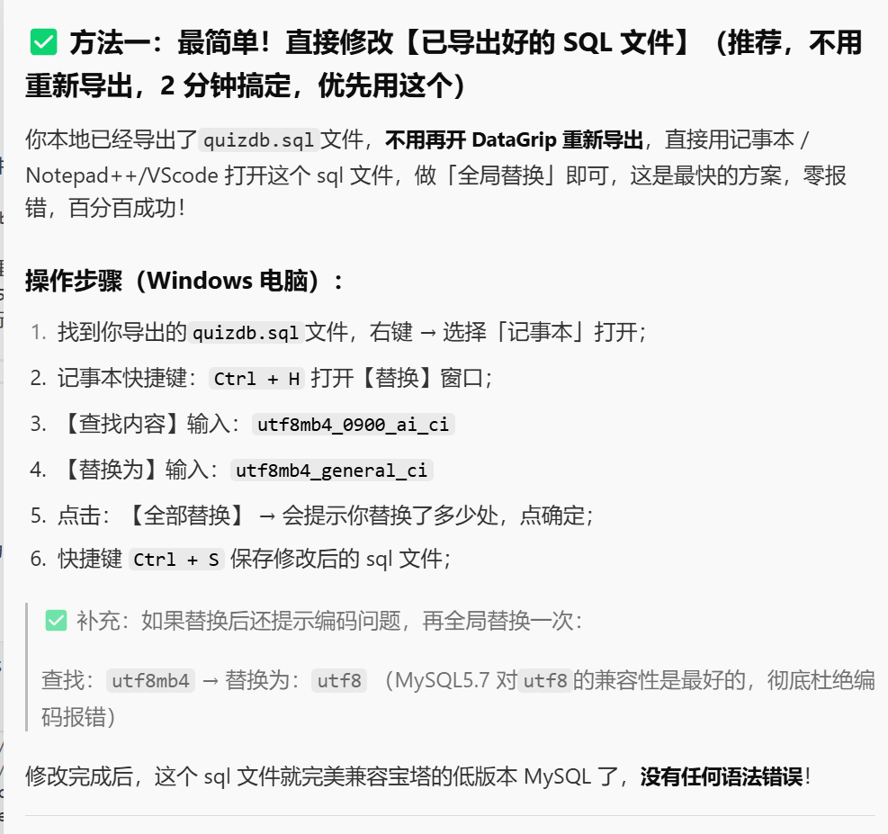

# 前后端分离架构（Vue 前端 + Java/SpringBoot 后端）项目部署
部署需要分「前端」「后端」「数据库」三个部分
优先选低成本 + 易操作的组合：
- 前端：免费静态托管平台（Netlify/Vercel，无需服务器）
- 后端：云服务器（学生机，每月 9 元起）
- 数据库：云服务器内置 MySQL（或用免费云数据库）
二、第一步：部署前端（Vue 项目，免费 + 5 分钟完成）
1. 本地打包前端代码
在 Vue 项目根目录执行命令，生成静态文件目录dist：
```bash
npm run build
```
2. 部署到 Netlify（免费、自动构建、带 HTTPS）
把前端代码推到 GitHub/Gitee 仓库（已有仓库可跳过）；
打开Netlify 官网，用 GitHub/Gitee 账号登录；
点击「Add new site」→「Import an existing project」，选择你的前端仓库；
配置构建参数（Netlify 会自动识别 Vue 项目，默认即可）：
构建命令：npm run build
发布目录：dist
点击「Deploy site」，等待 2 分钟，Netlify 会生成一个免费域名（如your-site.netlify.app），前端部署完成。
三、第二步：部署后端（Java/SpringBoot，学生机低成本）
1. 购买学生云服务器
推荐腾讯云轻量应用服务器（学生机）：
价格：1 核 2G/1M 带宽，每月 9 元（需学生认证）；
系统：选CentOS 7.x（Linux 系统，稳定常用）。
2. 服务器环境配置（用宝塔面板可视化操作）
登录腾讯云服务器控制台，通过「WebShell」登录服务器；
安装宝塔面板（可视化管理服务器）：
```bash
wget -O install.sh http://download.bt.cn/install/install_6.0.sh && bash install.sh
```
安装完成后，记录宝塔的登录地址（如http://服务器IP:8888）、账号密码；
登录宝塔面板，一键安装「LNMP 套件」（包含 Nginx/MySQL/Node.js）。
3. 部署后端代码
本地打包 SpringBoot 项目为jar包：
IDEA 中执行mvn package，生成target/xxx.jar；
上传 jar 包到服务器：
宝塔面板→「文件」→新建目录（如/www/backend），上传 jar 包；
启动后端服务：
安装「PM2 管理器」（宝塔软件商店）；
点击「添加项目」：
项目名称：自定义（如quiz-backend）
启动文件：选择上传的 jar 包
启动命令：java -jar xxx.jar --server.port=8080（指定端口）；
点击「启动」，后端服务在服务器8080端口运行。
四、第三步：部署数据库（MySQL，服务器内置）
宝塔面板→「软件商店」→安装MySQL 8.0；
点击「设置」→「数据库」→「添加数据库」：
数据库名：quiz_db
用户名 / 密码：自定义（如quiz_user/123456）；
导入本地数据库脚本：
本地导出 SQL 文件，在宝塔「数据库」→「导入」上传 SQL 文件。

mysqldump: [ERROR] unknown variable 'collation=utf8mb4_general_ci'.

✅ 本地 DataGrip 连接的是 MySQL 8.0 版本，导出的 SQL 里自带了高版本专属的排序规则 utf8mb4_0900_ai_ci；✅ 服务器宝塔的 MySQL 版本是 5.7/5.6 版本，不认识这个高版本规则，直接拒绝导入，同时连带报表不存在（因为建表语句第一步就执行失败了）。




五、第四步：连接前后端 + 配置域名
1. 后端配置数据库
修改 SpringBoot 项目的application.yml，将数据库连接改为服务器的 MySQL：
yaml
spring:
  datasource:
    url: jdbc:mysql://服务器IP:3306/quiz_db?useSSL=false&serverTimezone=Asia/Shanghai
    username: quiz_user
    password: 123456
重新打包 jar 包，上传到服务器并重启后端服务。
2. 前端配置后端接口地址
修改 Vue 项目的axios基础地址，指向服务器后端地址：
javascript
// 前端api请求文件
axios.defaults.baseURL = "http://服务器IP:8080/api"
重新打包前端代码，Netlify 会自动重新部署（关联了 Git 仓库的话，推送代码即可自动更新）。
六、最终访问
前端地址：Netlify 生成的免费域名（如your-site.netlify.app）；
后端接口：http://服务器IP:8080/api；
别人点击前端域名，即可访问你的在线答题网站。
（可选）优化：绑定自定义域名
如果需要更友好的域名（如quiz.xxx.com）：
购买域名（腾讯云 / 阿里云，每年 20 元起）；
前端：在 Netlify 中绑定域名（添加 DNS 解析记录）；
后端：在宝塔面板中配置 Nginx 反向代理，通过域名访问后端接口。
总结：成本与时间
成本：前端免费，后端学生机每月 9 元，域名每年 20 元，总成本每月 10 元左右；
时间：全程 1-2 小时（首次部署，熟练后 30 分钟完成）。