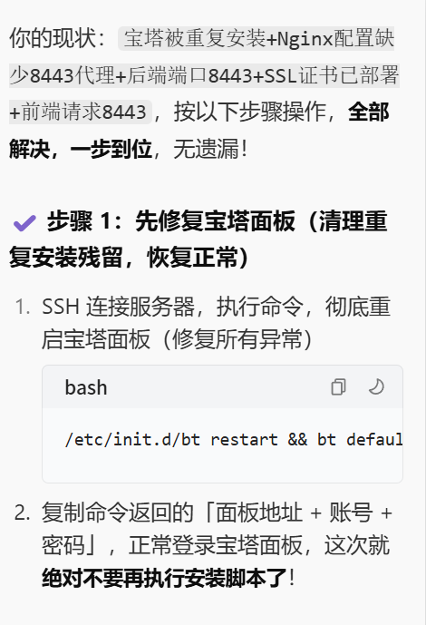
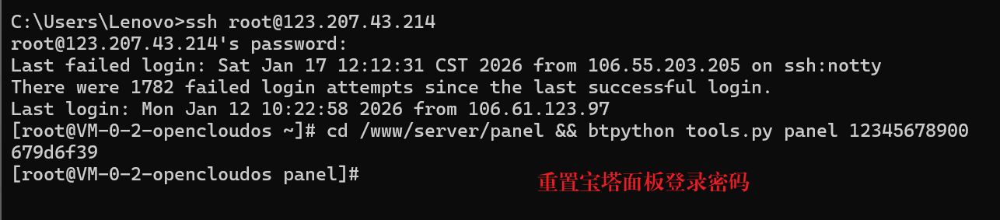
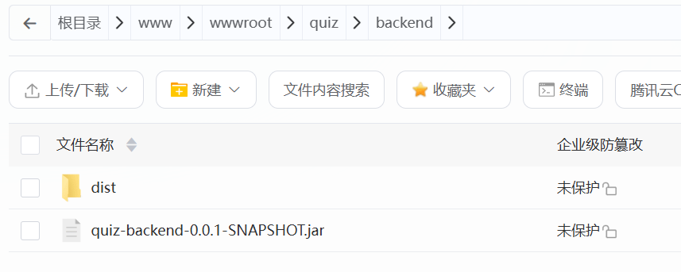
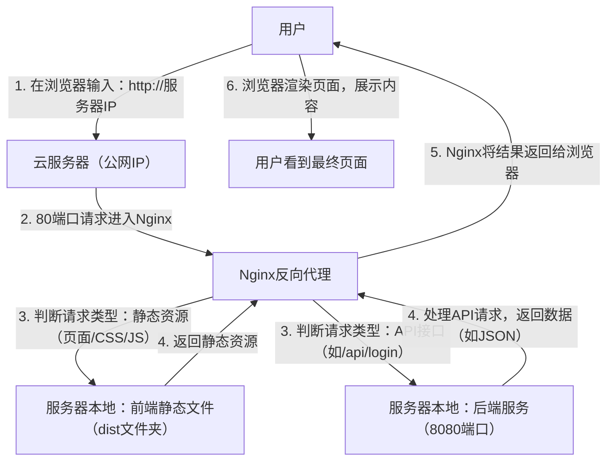
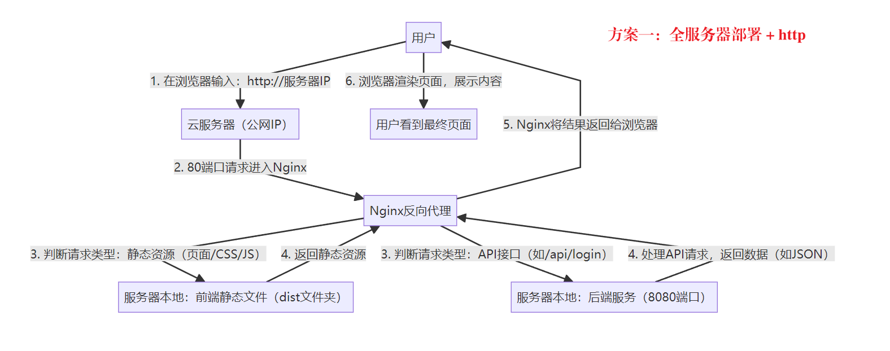
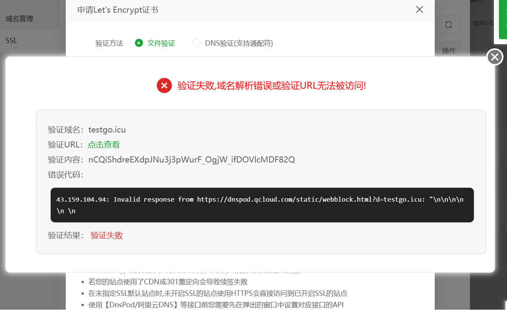
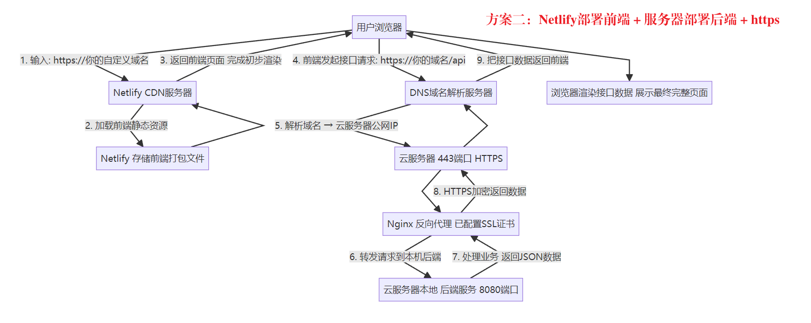
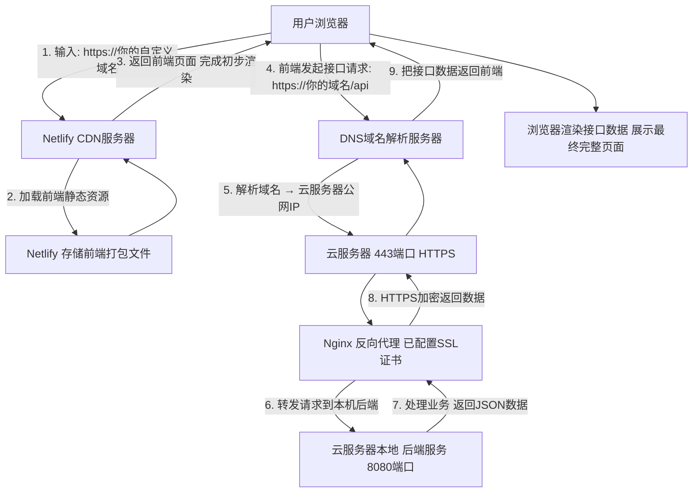

# 前后端分离架构（Vue 前端 + Java/SpringBoot 后端）项目部署
## 部署需要分「前端」「后端」「数据库」三个部分
优先选低成本 + 易操作的组合：
- 前端：免费静态托管平台（Netlify/Vercel，无需服务器）
- 后端：云服务器（学生机，每月 9 元起）
- 数据库：云服务器内置 MySQL（或用免费云数据库）

## 二、第一步：部署前端（Vue 项目，免费 + 5 分钟完成）
1. 本地打包前端代码
在 Vue 项目根目录执行命令，生成静态文件目录dist：
```bash
npm run build
```
2. 部署到 Netlify（免费、自动构建、带 HTTPS）
把前端代码推到 GitHub/Gitee 仓库（已有仓库可跳过）；
打开Netlify 官网，用 GitHub/Gitee 账号登录；
点击「Add new site」→「Import an existing project」，选择你的前端仓库；
配置构建参数（Netlify 会自动识别 Vue 项目，默认即可）：
构建命令：npm run build
发布目录：dist
点击「Deploy site」，等待 2 分钟，Netlify 会生成一个免费域名（如your-site.netlify.app），前端部署完成。
## 三、第二步：部署后端（Java/SpringBoot，学生机低成本）
1. 购买学生云服务器
推荐腾讯云轻量应用服务器（学生机）：
价格：2 核 2G/1M 带宽，每月 9 元（需学生认证）；
系统：选CentOS 7.x（Linux 系统，稳定常用，**宝塔面板部署**）。
2. 服务器环境配置（用宝塔面板可视化操作）
登录腾讯云服务器控制台，通过「WebShell」登录服务器；
安装宝塔面板（可视化管理服务器）：
```bash
wget -O install.sh http://download.bt.cn/install/install_6.0.sh && bash install.sh
```
这个命令只需要输入一次，记住给的账号和密码，下次再次登录，直接使用外网地址就行，重复运行会导致内存挤压，程序崩溃



安装完成后，记录宝塔的登录地址（如http://服务器IP:8888）、账号密码；
登录宝塔面板，一键安装「LNMP 套件」（包含 Nginx/MySQL/Node.js）。

>⚠ 如果忘记宝塔界面登录密码，重置方法：
` cmd + R `打开终端面板，输入 ` ssr 用户名@主机服务器ip `指定 SSR 客户端连接代理服务器

接着输入下面的代码
```bash
cd /www/server/panel && btpython tools.py panel 你的重置密码
```

完成以上操作就可以重新登录宝塔面板啦！

3. 部署后端代码
本地打包 SpringBoot 项目为jar包：
IDEA 中执行mvn package，生成target/xxx.jar；
上传 jar 包到服务器：
宝塔面板→「文件」→新建目录（如/www/backend），上传 jar 包；
启动后端服务：
安装「PM2 管理器」（宝塔软件商店）；
点击「添加项目」：
项目名称：自定义（如quiz-backend）
启动文件：选择上传的 jar 包
启动命令：java -jar xxx.jar --server.port=8080（指定端口）；
点击「启动」，后端服务在服务器8080端口运行。
## 四、第三步：部署数据库（MySQL，服务器内置）
宝塔面板→「软件商店」→安装MySQL 8.0；
点击「设置」→「数据库」→「添加数据库」：
数据库名：quiz_db
用户名 / 密码：自定义（如quiz_user/123456）；
导入本地数据库脚本：
本地导出 SQL 文件，在宝塔「数据库」→「导入」上传 SQL 文件。

> 如果出现报错信息：mysqldump: [ERROR] unknown variable 'collation=utf8mb4_general_ci'.

✅ 本地 DataGrip 连接的是 MySQL 8.0 版本，导出的 SQL 里自带了高版本专属的排序规则 utf8mb4_0900_ai_ci；✅ 服务器宝塔的 MySQL 版本是 5.7/5.6 版本，不认识这个高版本规则，直接拒绝导入，同时连带报表不存在（因为建表语句第一步就执行失败了）。


## 五、第四步：连接前后端 + 配置域名
1. 后端配置数据库
修改 SpringBoot 项目的application.yml，将数据库连接改为服务器的 MySQL：
yaml
spring:
    datasource:
    url: jdbc:mysql://服务器IP:3306/quiz_db?useSSL=false&serverTimezone=Asia/Shanghai
    username: quiz_user
    password: 123456
重新打包 jar 包，上传到服务器并重启后端服务。
2. 前端配置后端接口地址
修改 Vue 项目的axios基础地址，指向服务器后端地址：
javascript
// 前端api请求文件
axios.defaults.baseURL = "http://服务器IP:8080/api"
重新打包前端代码，Netlify 会自动重新部署（关联了 Git 仓库的话，推送代码即可自动更新）。
## 六、最终访问
前端地址：Netlify 生成的免费域名（如your-site.netlify.app）；
后端接口：http://服务器IP:8080/api；
> 此处，Netlify会强制将http请求转换成https请求，而https请求若是没有部署ssl证书和域名的加持，浏览器会识别成不安全网站，向后端请求资源的行为会被拦截

解决方案有两个：

**方案一：全服务器部署 ，使用http请求**
* 将前后端都部署在云服务器上，使用http请求和默认80端口，将前端项目打包，上传至后端项目
所在文件夹，使用Nginx进行反向代理
* 核心优势是 “零额外成本”（无需买域名、SSL 证书），适合个人测试、小型 demo 或非公开项目；
* 缺点： “HTTP” 有安全性缺陷（数据传输未加密，适合非敏感场景），且无法使用需要 HTTPS 的功能（如浏览器定位、PWA、部分第三方 API）； 前端静态资源和后端 API 都依赖同一台服务器的带宽和性能，若访问量增大，可能需要升级服务器配置；
* Nginx 的作用：监听服务器的 80 端口（HTTP 默认端口），当用户访问http://服务器IP时，Nginx 会 “转发请求”—— 静态资源（页面、CSS、JS）直接返回前端文件，API 请求（如/api/login）转发到后端的 8080 端口

云服务器上前后端目录结构：




请求发送流程图：



**方案二：Netlify 前端 + 服务器后端 ， 使用https请求**
* 如果坚持将前端部署在Netlify上，需要购买域名，申请SSL证书，购买域名后，需要解析域名（DNS[ Domain Name System]解析），与自己的服务器进行绑定，但是，这个方法，如果是在腾讯云购买域名，会提示你，只有备案过的域名才能进行解析，但是，只有购买期超过三个月的域名才能够备案
  
* 核心优势是 “生产级正式性”（HTTPS 加密、自定义域名），适合公开项目、面向用户的产品，但需承担域名 / SSL 成本（部分 SSL 免费），并遵守备案规则；前端静态资源由 Netlify 的 CDN（全球分发网络）加载，用户访问页面更快（就近获取资源），后端仅需处理 API 请求，服务器压力更小，更适合有一定访问量的项目。
* 后端服务器配置 SSL 证书（通过 Nginx 或后端框架本身），让后端接口支持https://你的域名:8080/api（或用 Nginx 监听 443 端口，转发到 8080，隐藏端口）—— 否则前端（HTTPS）调用后端（HTTP）仍会被浏览器拦截（混合内容错误）。
请求发送流程图：




简言之，方案一更加省钱，但是，方案二是较为正式的一种部署方案


