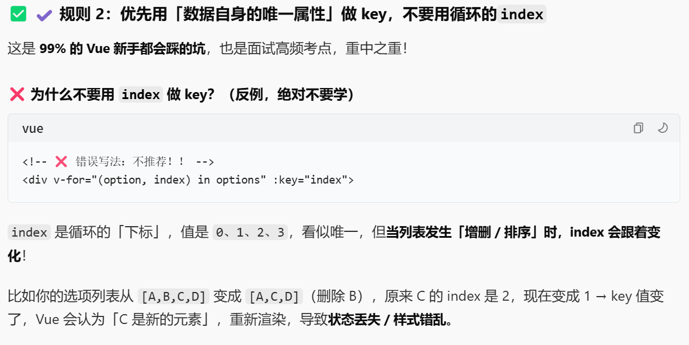

# 项目开发过程中遇到的问题
1. 静态方法调用非静态成员
   
    Quiz\backend\src\main\java\com\example\utils\PDFFileImport.java
     ```java
    @Autowired
    private QuestionRepository questionRepository;
    @Autowired
    private TikaServiceImpl tikaServiceImpl;

    public static void importPDF(File file) throws Exception {
        String result = tikaServiceImpl.extractTextFromPdf(file);  // ❌ 静态方法中调用实例成员
        // ...
        questionRepository.save(question);  // ❌ 静态方法中调用实例成员
    }
    ```
2. 依赖注入在静态方法中无效
   
   @Autowired 注解在静态上下文中不会生效，tikaServiceImpl 和 questionRepository 都会是 null。

修正方法：移除static

调用示例
```java
    @Service
    public class ImportService {
        
        @Autowired
        private PDFFileImport pdfFileImport;
        
        public void importFile(String filePath) {
            File file = new File(filePath);
            try {
                pdfFileImport.importPDF(file);
            } catch (Exception e) {
                // 处理异常
            }
        }
    }
```

3. 将重复使用到的样式从组件中分离出来复用
   1. 创建一个assets/style文件夹存放css样式
   2. 在main.js 中导入样式文件
   3. ```js
        import { createApp } from 'vue'
        import App from './App.vue'

        import "./assets/style/gStyle.css";

        createApp(App).mount('#app')
        ```

4. ```vue
    <template>
    {{ questionTypeText }}
    </template>
    <script>
    computed:{
        questionTypeText() {
                if (!this.currentQuestion) return ''
                return this.isMultiChoice ? '多选题' : '单选题'
            },
    }
    </script>
    ```
为什么这里不是 {{ questionTypeText() }}
```vue
<!-- ✅ 正确写法 (计算属性) -->
{{ questionTypeText }} 

<!-- ❌ 错误写法 (绝对不要加括号) -->
{{ questionTypeText() }}
```
> 核心原因：Vue 的「计算属性 computed」，本质是「属性」，不是「方法 methods」
> 属性调用 → 不加括号 {{ 属性名 }}
> 方法调用 → 必须加括号 {{ 方法名() }}

5. ```vue
    <script>
    method:{
        formatContent(content) {
            if (!content) return ''
            return content.replace(/\n/g, '<br>')
        },
    }
    </script>
    ``` 
    -  / / 是 JS 里正则表达式的定界符，表示这是一个正则规则；
    -  \n 是正则里的转义字符，专门匹配「文本换行符」。
    -  g 是英文 global 的缩写，意思是「全局的」。

6. v-html这是什么
```vue
<template>
    <div class="question-content" v-html="formatContent(currentQuestion.content)"></div>    
</template>
```
你问到的 v-html 刚好是和你上一行代码 content.replace(/\n/g, '<br>') 配套的核心指令，二者是「黄金搭档」，缺一不可！你写的换行符替换代码，必须配合 v-html 才能生效，这也是你答题系统里渲染题干 / 解析文本的核心写法
> ⚠️ 插值语法只会把内容当作「纯文本」渲染，不会解析任何 HTML 标签！
> ✅ 核心总结：
> {{ }} → 渲染纯文本，不解析 HTML
> v-html → 渲染HTML 内容，解析 HTML 标签

7. :key="option.key"
```vue
    :key="option.key"  ✔️ 简写形式 (你代码里的写法，推荐)
    v-bind:key="option.key" ✔️ 完整形式 (等价，写法更啰嗦)
```
作用：给 v-for 循环渲染出来的每一个 DOM 元素，绑定一个「唯一标识」

8.  「数组的 toggle 切换」
```vue
<script>
    const index = this.selectedOptions.indexOf(optionKey)
        if (index === -1) {
            this.selectedOptions.push(optionKey)
        } else {
            this.selectedOptions.splice(index, 1)
        }   
</script>
```
- Array.indexOf(optionKey)
  - 查找optionKey这个值第一次出现的「下标位置」
  - 找到了这个值，返回该值在数组中对应的数字下标
  - 没找到这个值，固定返回 -1
- Array.push(optionKey)
  - 把optionKey追加到数组的末尾
- Array.splice(index, 1)
  - 从数组的index下标位置，删除1个元素
9. 
```vue
<script>
     formatUserMultiAnswer() {
      if (this.selectedOptions.length === 0) return '未选择'
      return [...this.selectedOptions].sort().join('、')
    } 
</script>
```
[...this.selectedOptions] 
 语法作用：把原数组 this.selectedOptions 浅拷贝一份，生成一个全新的数组，原数组完全不会被修改。
 ✅ 补充：因为前面做了数组拷贝，这里sort()修改的只是「副本数组」，你的原数组this.selectedOptions的顺序完全不变！
10. @keyup.enter="jumpToInputQuestion"
当当前元素获得焦点时，按下键盘的【回车键 (Enter)】，松开回车按键的瞬间，触发执行 jumpToInputQuestion 这个方法
11. ```vue
    <template>
     <button 
          @click="retryQuestion" 
          v-if="showAnswer"
          class="btn-retry"
        >
    </template>
    ```
retryQuestion是methods，为什么这里不加（）
> 不加()的原因：当你的事件处理函数 不需要传递任何参数 时，Vue 允许直接写函数名，这是简写语法，完全等价于加括号的写法，而且是更推荐的写法。
 原因 2：Vue 会自动帮你传递【原生事件对象$event】

✔️ 当你写 @click="retryQuestion"（不加括号）时，Vue 会自动把「原生的点击事件对象」作为第一个参数，传递给 retryQuestion 方法。

✔️ 当你写 @click="retryQuestion()"（加括号）时，Vue 会不会传递任何参数，方法里拿不到事件对象，除非你手动传。

当你的事件处理函数 需要传递自定义参数 时，就必须加括号，否则 Vue 不知道你要传什么参数

传参时，同时想要拿到「原生事件对象」怎么办？
```vue
<template>
   <!-- 传自定义参数 + 原生事件对象，必须加括号，手动写 $event -->
    <button @click="retryQuestion(100, $event)">重试</button>
</template>
```
> 小知识点：$event 是 Vue 的内置关键字，专门用来指代「原生 DOM 事件对象」，只有在事件绑定中能用。

12. 前端结构命令行打印
参考文章
https://github.com/derycktse/treer

安装全局依赖包
```bash
npm install -g treer
```
忽略单个文件并导出到目录下
```bash
treer -i "node_modules" -e "frontend.txt"
```
13. 查看git里面有哪些文件
```bash
git ls-files
```

14. 组件式开发
导入 -> 注册 -> 使用 才会渲染组件
```vue
<template>
  <div class="container">
    <!-- ✅ 直接使用注册好的组件标签，和注册名一致 -->
    <Quiz></Quiz>
  </div>
</template>

<script>
// 导入组件
import Quiz from './components/Quiz.vue'
// 局部注册组件
export default {
  components: { Quiz }
}
</script>
```
【全局注册组件】（对比理解）

如果想让Quiz组件在项目所有组件中都能直接使用，不用重复导入注册，可以全局注册，在main.js中写：
```js
// main.js 项目入口文件
import Vue from 'vue'
import Quiz from './components/Quiz.vue'

// 全局注册组件
Vue.component('Quiz', Quiz)
```
全局注册后，项目中任何组件的<template>里，直接写<Quiz></Quiz>即可，无需再导入注册。
> ✅ 适用场景：项目中高频复用的组件（如按钮、弹窗、答题组件）；
> ❌ 注意：全局注册的组件，不管是否使用，打包时都会被打包进项目，可能增加体积。
